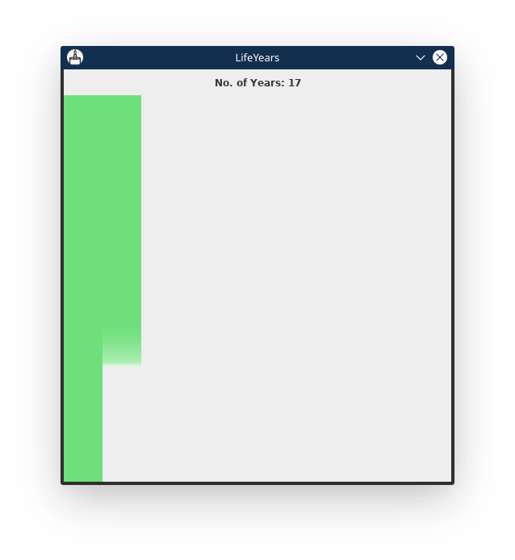

# LifeYears
A program to show user's life in block of years.
#### The application can be run by either:

- running `java GUI` : this runs the application in full GUI mode, even the input of DOB is graphical
- running `java LifeYears` : this takes the input of DOB through terminal and after a valid input shows the year blocks in GUI.

#### Screenshots:
- if `java LifeYears` is run like this

 

and a valid input is provided, then the GUI frame comes up, like this: 

- if `java GUI` is run like this 

then a GUI input box pops up, like this:

and on entering valid input here, the GUI frame comes up, like this:

